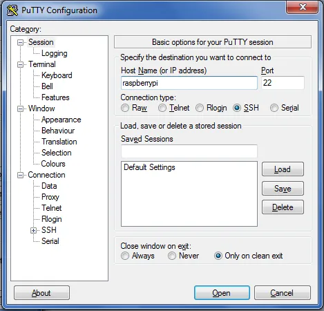
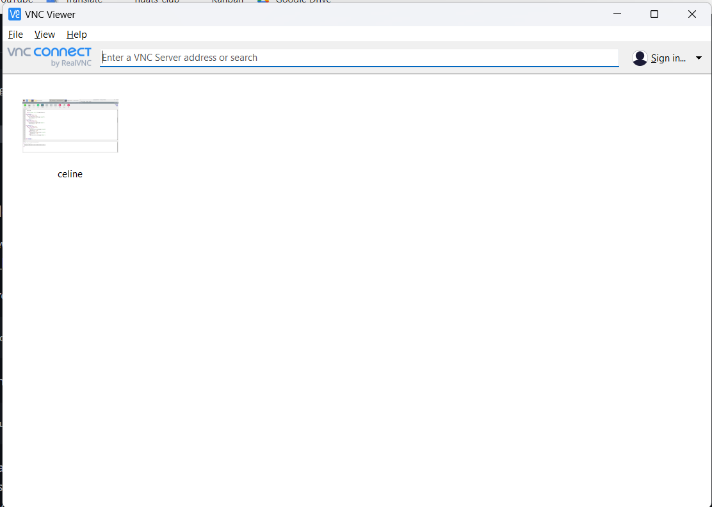
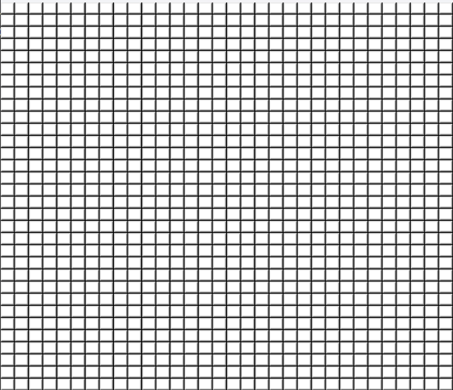
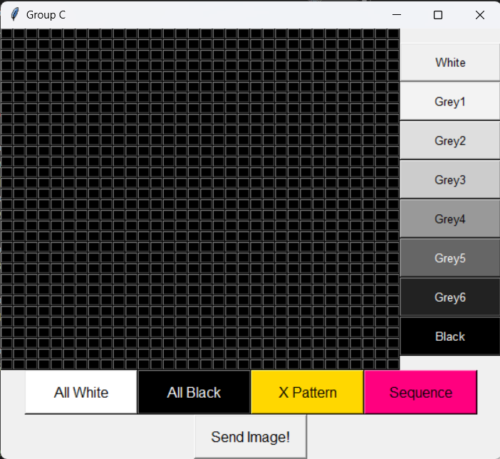
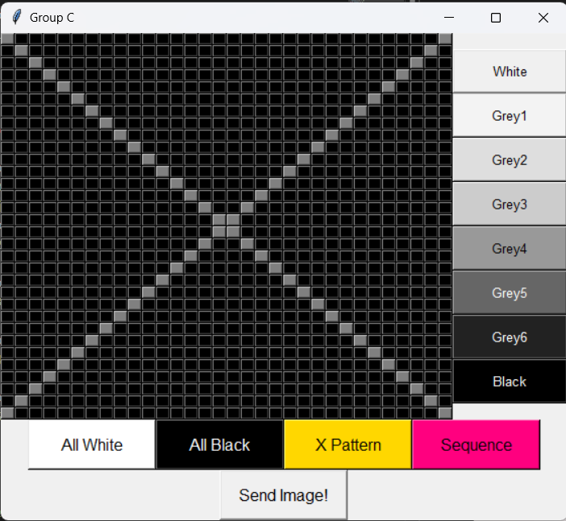
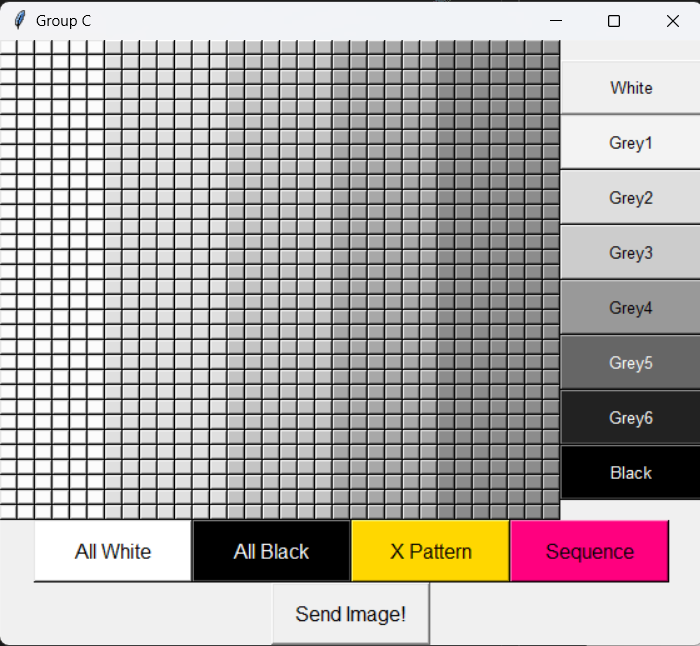
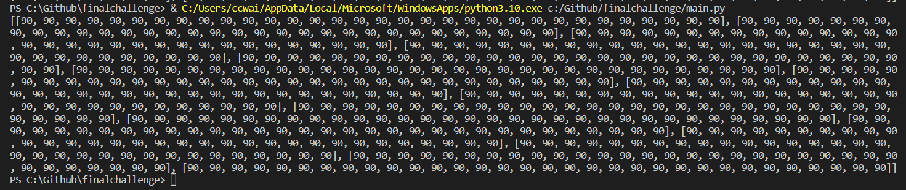
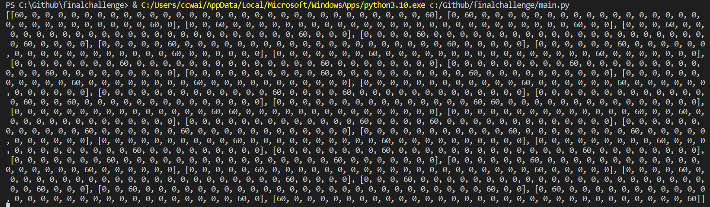
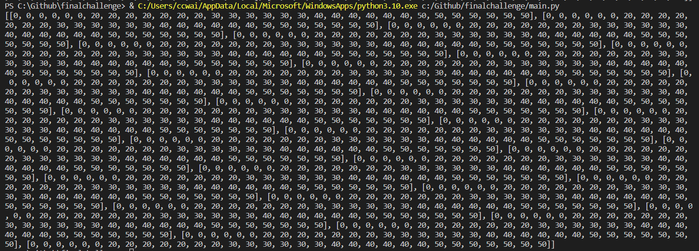

# 32 x 32 GUI Documentation 
This documentation is an introduction about the 32 x 32 GUI and it's features. The purpose of this GUI is to control the polarised motor to display a pixelated image. Users can choose from an array of different shades of grey as well as preset patterns to play with the GUI. 

Example of the pixelated image. <br>


## Final Look of the GUI 


# Installation of Software and Hardware
## Hardware
**Model** : RaspberryPi 4 Model B <br>
**OS** : Raspbian <br>
**Version** : Buster


## Software 
1. PuTTy
2. Advanced Port Scanner
3. VNC Viewer

# Setting up the Raspberry Pi x
 Note: Only do the following on first initial boot

## PuTTy 
PuTTy allows free implementation of SSH for PCs running Microsoft Windows. After installing PuTTy, enter the hostname "raspberrypi".<br> **(missing 1 more step)**




After you entered the hostname, click "open" and a command prompt window should appear. Enter your username and password here. The Raspbian default login is user “pi” with password “raspberry“.


You may change you password with the following command: ```sudo passwd```

### 1. Update Raspberry pi
Onced logged in, update the Raspberry Pi. 
```
sudo apt update
sudo apt upgrade
```
### 2. Configuring Raspberry pi
### Enable SSH <br>
SSH is a is a network protocol that gives users, particularly system administrators, a secure way to access a computer over an unsecured network. To enable SSH type the following,
```
sudo raspi-config
```
Select ```3 Interface Options```<br>
Select ```P2 SSH```<br>
Select **Enable SSH**

## VNC Viewer
### Enable Virtual Network Computing (VNC) <br>
VNC is a cross-platform screen sharing system that was created to remotely control another computer. To enable VNC, open terminal on your Raspberry Pi and try the following. 
```
sudo raspi-config
```
Select ```3 Interface Options```<br>
Select ```P3 VNC```<br>
Select **Enable VNC**

## Advanced Port Scanner
Use Advanced Port Scanner to scan your network ip address in order to connect to VNC Viewer. Click "Start" to scart scanning. 


Next, open VNC Viewer. Enter your Raspberry Pi ip address to to remotely access the desktop of your Raspberry Pi over the internet. 


Enter the username and password for the raspberry pi login and press "OK". 


The VNC session should start, and you should see your Raspberry Pi desktop.


# Setting Up The GUI
To create a tkinter GUI, we need to import the tkinter library. 
```
from tkinter import *
```
To create a window with our group title. 
```
main = Tk()
main.title("Group C")
```

For the window to stay on the screen, we need to loop it. 
```
main.mainloop()
```

Output <br>


# Frame Function
We are using the frame function to group and organize the widget to make it neater so that it is user friendly.

Frame1 is to indicate the first frame for the 32x32 grid.
```
frame1 = Frame(main)
frame1.grid(row=0, column=0)
```
Frame2 is to indicate the second frame for the shades buttons. 
```
frame2 = Frame(main) 
frame2.grid(row=0, column=1)
```
Frame 3 is to indicate the third frame for the features buttons. 
```
frame3 = Frame(main)
frame3.grid(row=1, columnspan=2)
```
Frame4 is to indicate the fourth frame for the send button. 
```
frame4 = Frame(main)
frame4.grid(row=2, columnspan=2)
```
Output <br>


# Create 32 x 32 Buttons
We are using a list of list and nested for loop to create a 32 x 32 buttons. 
```
button = [[j for j in range(32)] for i in range(32)]

for j in range (32):
  for i in range (32):
    button[i][j] = Button(frame1, font=("Calibri, 5"), width=1, height=1)
    button[i][j].grid(row=i, column=j)
```
Output <br>


# Create Shades Buttons
Below is the codes to create shades buttons. Change the text and background colour accordingly to get different shades buttons. 
```
white = Button(frame2, text="White", font=("Calibri, 10"), bg='grey99', width=13, height=2)
white.grid(row=0, column=0)

grey1 = Button(frame2, text="Grey1", font=("Calibri, 10"), bg='grey88', width=13, height=2)
grey1.grid(row=1, column=0)

grey2 = Button(frame2, text="Grey2", font=("Calibri, 10"), bg='grey77', width=13, height=2)
grey2.grid(row=2, column=0)

grey3 = Button(frame2, text="Grey3", font=("Calibri, 10"), bg='grey66', width=13, height=2)
grey3.grid(row=3, column=0)

grey4 = Button(frame2, text="Grey4", font=("Calibri, 10"), bg='grey44', width=13, height=2)
grey4.grid(row=4, column=0)

grey5 = Button(frame2, text="Grey5", font=("Calibri, 10"), bg='grey33', fg='white', width=13, height=2)
grey5.grid(row=5, column=0)

grey6 = Button(frame2, text="Grey6", font=("Calibri, 10"), bg='grey11', fg='white', width=13, height=2)
grey6.grid(row=6, column=0)

black = Button(frame2, text="Black", font=("Calibri, 10"), bg='grey1', fg='white', width=13, height=2)
black.grid(row=7, column=0)
```
Output <br>


## Assign function to the 32x32 buttons and shades Buttons
Create a variable to store colour value. 
```
colour = 0
```
Use Lambda Function for the 32x32 grid and the shades button. Lambda Function can be used anywhere that function objects are required. 
```
def change_colour(m): 
  global colour
  colour=m 
```
Add the command to the shades buttons. 
```
white = Button(frame2, text="White", font=("Calibri, 10"), bg='grey99', width=13, height=2, command=lambda m=0:change_colour(m))
white.grid(row=0, column=0)

grey1 = Button(frame2, text="Grey1", font=("Calibri, 10"), bg='grey88', width=13, height=2, command=lambda m=1:change_colour(m))
grey1.grid(row=1, column=0)

grey2 = Button(frame2, text="Grey2", font=("Calibri, 10"), bg='grey77', width=13, height=2, command=lambda m=2:change_colour(m))
grey2.grid(row=2, column=0)

grey3 = Button(frame2, text="Grey3", font=("Calibri, 10"), bg='grey66', width=13, height=2, command=lambda m=3:change_colour(m))
grey3.grid(row=3, column=0)

grey4 = Button(frame2, text="Grey4", font=("Calibri, 10"), bg='grey44', width=13, height=2, command=lambda m=4:change_colour(m))
grey4.grid(row=4, column=0)

grey5 = Button(frame2, text="Grey5", font=("Calibri, 10"), bg='grey33', fg='white', width=13, height=2, command=lambda m=5:change_colour(m))
grey5.grid(row=5, column=0)

grey6 = Button(frame2, text="Grey6", font=("Calibri, 10"), bg='grey11', fg='white', width=13, height=2, command=lambda m=6:change_colour(m))
grey6.grid(row=6, column=0)

black = Button(frame2, text="Black", font=("Calibri, 10"), bg='grey1', fg='white', width=13, height=2, command=lambda m=7:change_colour(m))
black.grid(row=7, column=0)
```
Use if else statement to create fucntion for the white buttons. 
```
def whitebtn(i, j):
  global colour

  if colour == 0:
    button[i][j].config(bg='grey99')
  elif colour == 1: 
    button[i][j].config(bg='grey88')
  elif colour == 2:
    button[i][j].config(bg='grey77')
  elif colour == 3: 
    button[i][j].config(bg='grey66')
  elif colour == 4:
    button[i][j].config(bg='grey44')  
  elif colour == 5: 
    button[i][j].config(bg='grey33')
  elif colour == 6:
    button[i][j].config(bg='grey11')
  else: 
    button[i][j].config(bg='grey1')
```
Add command to the button codes. 
```
button = [[j for j in range(32)] for i in range(32)]

for j in range (32):
  for i in range (32):
    button[i][j] = Button(frame1, font=("Calibri, 5"), width=1, height=1, command=lambda r=i, c=j:whitebtn(r, c))
    button[i][j].grid(row=i, column=j)
```
Output <br>


# Features Buttons 
To create the features buttons, the code is similar to the shades button. Change the text and background colour accordingly. 
```
allwhite = Button(frame3, text="All White",font=("Calibri, 12"), bg='white', width=13, height=2)
allwhite.grid(row=0, column=0)

allblack = Button(frame3, text="All Black",font=("Calibri, 12"), bg='black', fg='white', width=13, height=2)
allblack.grid(row=0, column=1)

xpattern = Button(frame3, text="X Pattern",font=("Calibri, 12"), bg='gold', width=13, height=2)
xpattern.grid(row=0, column=2)

seq = Button(frame3, text="Sequence",font=("Calibri, 12"), bg='#ff007f', width=13, height=2)
seq.grid(row=0, column=3)
```
Output <br>


## Assign function to the features buttons
Below are the function codes for All White. 
```
def allwht():
  for j in range (32):
    for i in range (32):
      button[i][j].config(bg='grey99')
```

Below are the function codes for All Black.
```
def allblk():
  for j in range (32):
    for i in range (32):
      button[i][j].config(bg='grey1')
```

Below are the function codes for X Pattern. 
```
def pattern():
  for j in range (32):
    for i in range (32):
      if i == j: 
        button[i][j].config(bg='grey33')
      elif i + j == 31: 
        button[i][j].config(bg='grey33')
      else:
        button[i][j].config(bg='white')

```

Below are the function codes for Sequence. 
```
def ramseq():
  for j in range (32):
    for i in range (32):
      if j < 6:
        button[i][j].config(bg='grey99')
      elif j >= 6 and j <= 12:
        button[i][j].config(bg='grey88')
      elif j >= 12 and j <= 18:
        button[i][j].config(bg='grey77')
      elif j >= 18 and j <= 24:
        button[i][j].config(bg='grey66')
      elif j >= 24 and j <= 32:
        button[i][j].config(bg='grey55')
```

Add the commands to the features buttons. 
```
allwhite = Button(frame3, text="All White",font=("Calibri, 12"), bg='white', width=13, height=2, command=allwht)
allwhite.grid(row=0, column=0)

allblack = Button(frame3, text="All Black",font=("Calibri, 12"), bg='black', fg='white', width=13, height=2, command=allblk)
allblack.grid(row=0, column=1)

xpattern = Button(frame3, text="X Pattern",font=("Calibri, 12"), bg='gold', width=13, height=2, command=pattern)
xpattern.grid(row=0, column=2)

seq = Button(frame3, text="Sequence",font=("Calibri, 12"), bg='#ff007f', width=13, height=2, command=ramseq)
seq.grid(row=0, column=3)
```

Output for All White feature button <br>


Output for All Black feature button <br>


Output for x pattern feature button<br>


Output for sequence feature button <br>


# Send Button 
When the send button is pressed, it will output the value of the different shades. 
Below is the codes to create send button. 
```
send = Button(frame4, text="Send Image!", font=("Calibri, 12"), width=13, height=2)
send.grid(row=0, column=0)
```
Output <br>


## Assign function to the send button. 
First, create a variable to store the value. 
```
value = [[0 for i in range(32)] for j in range(32)]
```
Next, add value to the 32 x 32 button's function, shades button's function and features button's function. <br>
Below are the code for 32x32 buttons after adding the value. 
```
def whitebtn(i, j):
  global colour, value

  if colour == 0:
    button[i][j].config(bg='grey99')
    value[i][j] = 0
  elif colour == 1: 
    button[i][j].config(bg='grey88')
    value[i][j] = 20
  elif colour == 2:
    button[i][j].config(bg='grey77')
    value[i][j] = 30
  elif colour == 3: 
    button[i][j].config(bg='grey66')
    value[i][j] = 40
  elif colour == 4:
    button[i][j].config(bg='grey44')  
    value[i][j] = 50
  elif colour == 5: 
    button[i][j].config(bg='grey33')
    value[i][j] = 60
  elif colour == 6:
    button[i][j].config(bg='grey11')
    value[i][j] = 70
  else: 
    button[i][j].config(bg='grey1')
    value[i][j] = 90
```
Below are the code for All White and All Black button after adding the value. 
```
def allwht():
  for j in range (32):
    for i in range (32):
      button[i][j].config(bg='grey99')
      value[i][j] = 0

def allblk():
  for j in range (32):
    for i in range (32):
      button[i][j].config(bg='grey1')
      value[i][j] = 90
```
Below are the code for X Pattern button after adding the value. 
```
def pattern():
  for j in range (32):
    for i in range (32):
      if i == j: 
        button[i][j].config(bg='grey33')
        value[i][j] = 60
      elif i + j == 31: 
        button[i][j].config(bg='grey33')
        value[i][j] = 60
      else:
        button[i][j].config(bg='white')
```
Below are the code for sequence after adding the value. 
```
def ramseq():
  for j in range (32):
    for i in range (32):
      if j < 6:
        button[i][j].config(bg='grey99')
        value[i][j] = 0
      elif j >= 6 and j <= 12:
        button[i][j].config(bg='grey88')
        value[i][j] = 20
      elif j >= 12 and j <= 18:
        button[i][j].config(bg='grey77')
        value[i][j] = 30
      elif j >= 18 and j <= 24:
        button[i][j].config(bg='grey66')
        value[i][j] = 40
      elif j >= 24 and j <= 32:
        button[i][j].config(bg='grey44')
        value[i][j] = 50 
```
Function code for send button. 
```
def sendbtn():
  print(value)
```

Add in the command for send button 
```
send = Button(frame4, text="Send Image!", font=("Calibri, 12"), width=13, height=2, command=lambda :sendbtn())
send.grid(row=0, column=0)
```

Output of the value of All White.<br>


Output of the value of All Black.<br>


Output of the value of All X Pattern.<br>


Output of the value of Sequence.<br>


# How to run the program on terminal **(provide figure can explain better)**
1. Open the terminal on raspberryPi.  
2. In the terminal, type the following commands: <br>
This is assuming you saved the file under the 'EGL314' folder on the desktop,
  - ``` cd /home/pi/Desktop/EGL314/ ```
  - ``` python3 filename ```
