# Wonders Of Our Childhood 
In this documentation, we will be explaining about the different features of our project. Our theme is "Wonders Of Our Childhood", our features are based on our childhood that encapsulates the memories of the simpler times where we would play these games when we were younger. 

## Project Learning Point
Our key takeaway is the ability to actually understand how polarisation works as the logic behind its concept allowed us to come up with creatve features for our project. We also learnt about the hardware side of the project where we figured out how to solder the board on our own and install the motors. For the software, we learnt about how the client can talk to the master pi which will then communicate the data to the esp board. Aside from that, learning to code our own features was also a very important learning point for us as it encourages problem-thinking skills. 
We want to showcase to our target audience about the physics of polarisation and brewster angle through our interactive games. 

## Project Backstory
Behind these arcade games, there is always something to learn behind the scenes and we wanna tell them how interesting and cool it is. How they are made better with inovation and how the may be relatively complex to build.

## Research 
Why these particular features? Because there is some form of nostalgia as these are games we have played at least once during our childhood which also adds relatability to our audience. 

# Table of Contents 
- [System Diagram](#system-diagram)
  - [Hardware](#hardware)
  - [Software](#software)
- [Installation](#installation)
  - [Hardware](#installation-of-hardware)
  - [Software](#installation-of-software)
- [Setting up Raspberry Pi](#setting-up-raspberry-pi)
- [Setting up GUI](#setting-up-gui)
  - [Frame Function](#frame-function)
- [Features](#features)
  - [Draw](#draw)
  - [Tic-Tac-Toe](#tic-tac-toe)
  - [Laser Maze](#laser-maze)
      - [Hardware](#hardware-for-the-laser-maze)
      - [Software](#software-for-laser-maze-gui)
- [Final Look of the GUI](#final-look-of-gui)
- [How to Run Main.py on Terminal](#how-to-run-main-gui-file-on-terminal)


# System Diagram
## Hardware

*Fu Yongwei, huats-club/EGL314starterkit* <br>
*Credit: https://github.com/huats-club/EGL314starterkit*

## Software 

*Code Flow Chart*

# Installation 
## Installation of Hardware
**Model** : RaspberryPi 4 Model B <br>
**OS Version** : Raspbian GNU/Linux 10 (buster) <br>
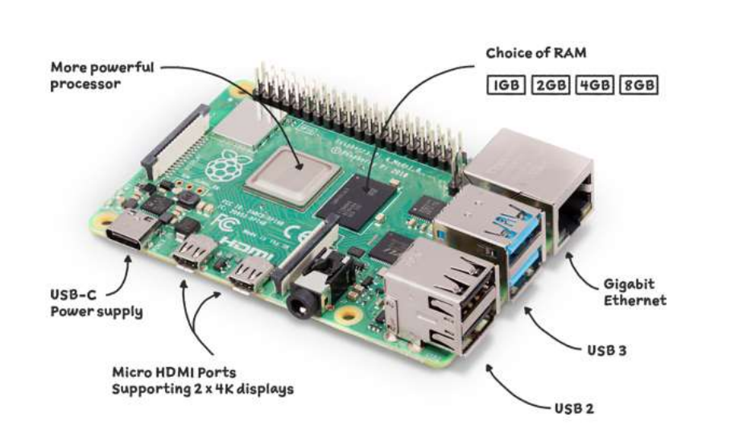 <br>
*Fu Yongwei, EGL314 - Lecture 1 Module Introduction*

## Installation of Software
1. PuTTy
2. Advanced Port Scanner
3. VNC Viewer
4. Pi GPIO Library
5. Pygame

## PuTTy 
PuTTy allows free implementation of SSH for PCs running Microsoft Windows. After installing PuTTy, enter the hostname "raspberrypi".<br>

 <br>
*Credit: https://tutorials-raspberrypi.com/raspberry-pi-remote-access-by-using-ssh-and-putty/*

## Advanced Port Scanner
Use Advanced Port Scanner to scan your network ip address in order to connect to VNC Viewer. Click "Start" to scart scanning. 

 <br>
*Screenshot of Advanced Port Scanner* <br>

## VNC Viewer
Next, open VNC Viewer. Enter your Raspberry Pi ip address to remotely access the desktop of your Raspberry Pi over the internet.

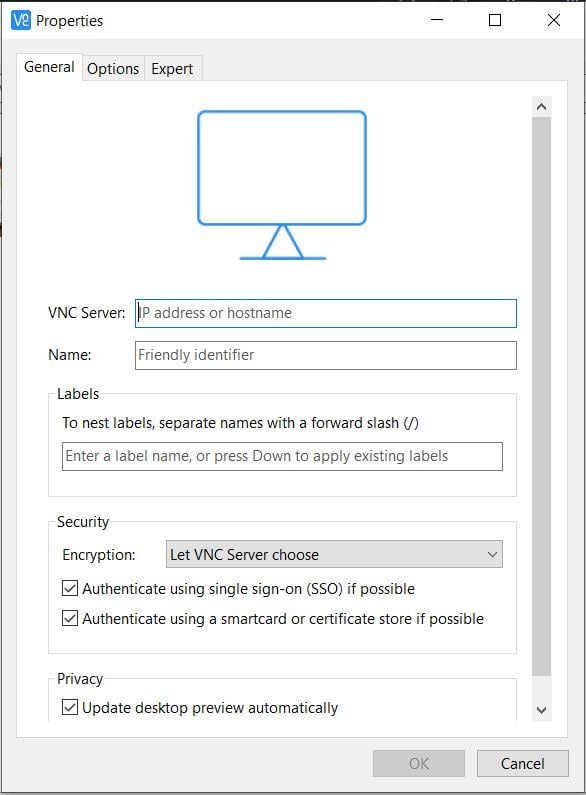 <br>
*Screenshot of VNC Viewer*

This step is to create new connection for raspberry pi. 

*Screenshot of VNC Viewer*

Enter the username and password for the raspberry pi login and press "OK". 

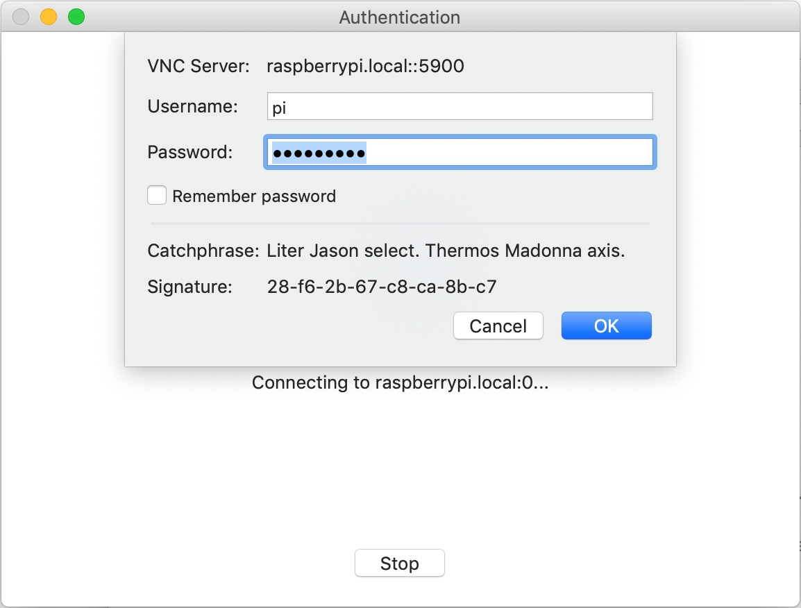
*Credit: https://www.pitunnel.com/doc/access-vnc-remote-desktop-raspberry-pi-over-internet*

The VNC session should start, and you should see your Raspberry Pi desktop.


*Credit: https://www.pitunnel.com/doc/access-vnc-remote-desktop-raspberry-pi-over-internet*


To start coding, click on the raspberry pi logo and under Programming, look for Thonny Python IDE and click on it.


*Credit: https://roboticsbackend.com/thonny-ide-raspberry-pi-os/*

<br>

## Pygame

This is the code to install the pygame library which is used to control the audio. 

Enter the following line in the Raspberry Pi terminal.

```
pip install pygame
```

# Setting up Raspberry Pi
Note: Only do the following on first initial boot.

After you entered the hostname, click "open" and a command prompt window should appear. Enter your username and password here. The Raspbian default login is user “pi” with password “raspberry“.

 <br>
*Credit: https://librarymakers.net/using-cli-raspberry-pi*

You may change your password with the following command: ```sudo passwd```


### 1. Update Raspberry pi
Once logged in, update the Raspberry Pi. 
```
sudo apt update
sudo apt upgrade
```
### 2. Configuring Raspberry pi
### Enable SSH <br>
SSH is a is a network protocol that gives users, particularly system administrators, a secure way to access a computer over an unsecured network. To enable SSH type the following,
```
sudo raspi-config
```
Select ```3 Interface Options```<br>
Select ```P2 SSH```<br>
Select **Enable SSH**

### Enable Virtual Network Computing (VNC) <br>
VNC is a cross-platform screen sharing system that was created to remotely control another computer. To enable VNC, open terminal on your Raspberry Pi and try the following. 
```
sudo raspi-config
```
Select ```3 Interface Options```<br>
Select ```P3 VNC```<br>
Select **Enable VNC**

# Setting up GUI
To create a tkinter GUI, we need to import the tkinter library. 
```
from tkinter import *
```
To create a window with our group title. 
```
main = Tk()
main.title("Group C")
```
For the window to stay on the screen, we need to loop it. 
```
main.mainloop()
```
Output <br>

 <br>
*Screenshot of a sample window*

 ## Frame Function 
We are using the frame function to group and organize the widget to make it neater so that it is user friendly. Below are the three main frames that form the GUI. 

Frame1 is to indicate the title for different features 
```
titleframe = Frame(main)
titleframe.grid(row=0, columnspan=2)
```
Frame2 is to indicate the content of different features 
```
contentframe = Frame(main)
contentframe.grid(row=1, column=0)
```
Frame 3 is to indicate the mode buttons to change between different features. 
```
modeframe = Frame(main)
modeframe.grid(row=1, column=1, padx=15, pady=15)
```
Output <br>
 <br>
*Screenshot of a frame window*

# Features
## Tic-Tac-Toe
Feature 1 is the classic TicTacToe game. You can choose to be either Player 1 or Player 2 based on selecting the X or O symbol as shown in the interface below.

<br>
This scenario is when O wins the game

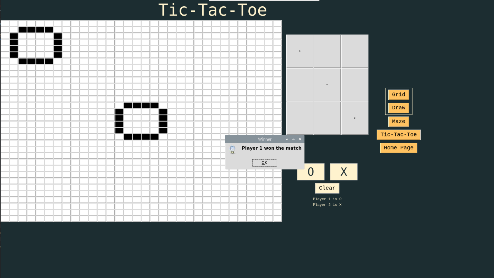
*Screenshot of TicTacToe page in GUI*

<br>
This scenario is when X wins the game


*Screenshot of TicTacToe page in GUI*

## Draw
Users can select one of the colour shades,then press and hold the left click of a mouse or trackpad to draw on the canvas then have it converted to grid form. By clicking the "save" button after drawing, followed by the grid page button on the side to see it convert. Lastly, the send image button to display the image on the panel.


*Screenshot of Draw page in GUI*
<br>

This is how it looks like when a user draws on the canvas. 

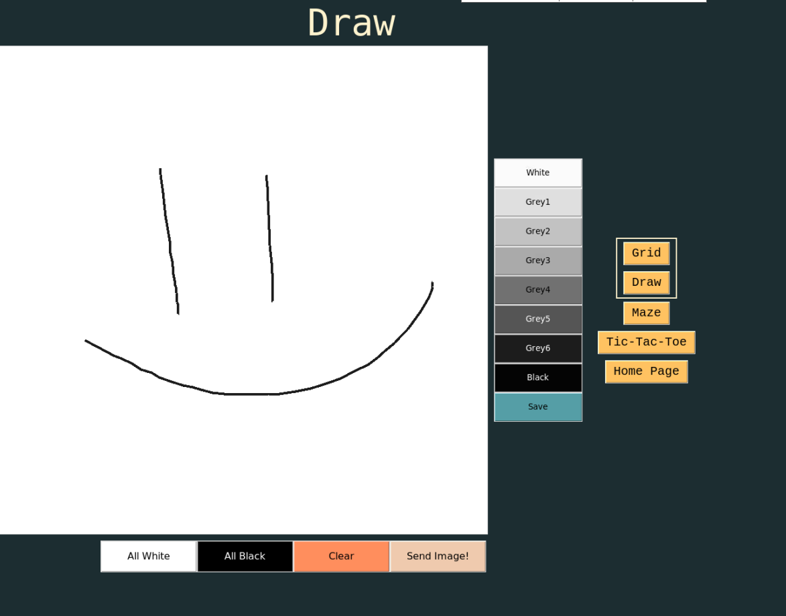
*Screenshot of Draw page in GUI*
<br>

This is how the drawing looks when the user save it and changes it to grid form.


*Screenshot of Draw page in GUI*

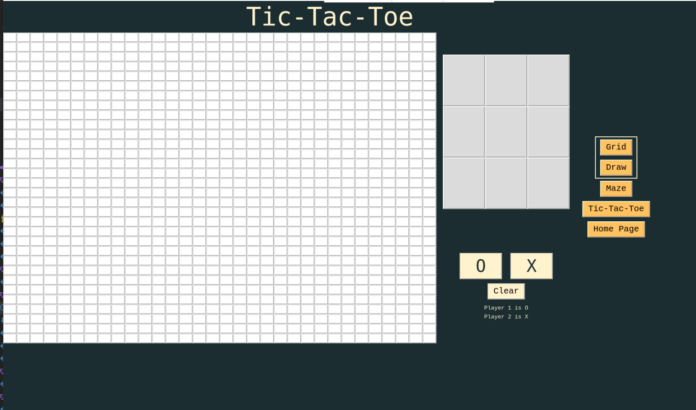
*Screenshot of TicTacToe page in GUI*

## Laser Maze
## Hardware for the Laser Maze
The laser maze consist of 3 SG90 servos, 6 mirrors, breadboard, RaspberryPi, laser, jumperwires, photodiode sensor, 2 polarizers.<br>

2 mirrors and 1 polarizer is attacted to the each of the servo to make it movable to direct the laser to the sensor. 

The cardboard used as a base for the maze is 65cm x 45cm

 <br>
*Image of the cardboard used for the maze*

The box that is used to hold the laser is 17cm x 12cm

 <br>
*Image of cardboard used for the maze*

This shows the Raspberry Pi and breadboard used to wire the hardware. Withon the black cone is the photodiode sensor.
<br>
*Image of cardboard used for the maze*

Final look for the laser maze. 
<br>
*Image of cardboard used for the maze*

<br>

## Software for Laser Maze GUI
### Pi GPIO Library
Go to this link to view all commands to install the PiGPIOd library, reduces jitter on servo motor

<br>*Credit: http://abyz.me.uk/rpi/pigpio/download.html*<br>

Code used to install Library as shown in image, enter in Terminal of Raspberry Pi
```
wget https://github.com/joan2937/pigpio/archive/master.zip
unzip master.zip
cd pigpio-master
make
sudo make install
```
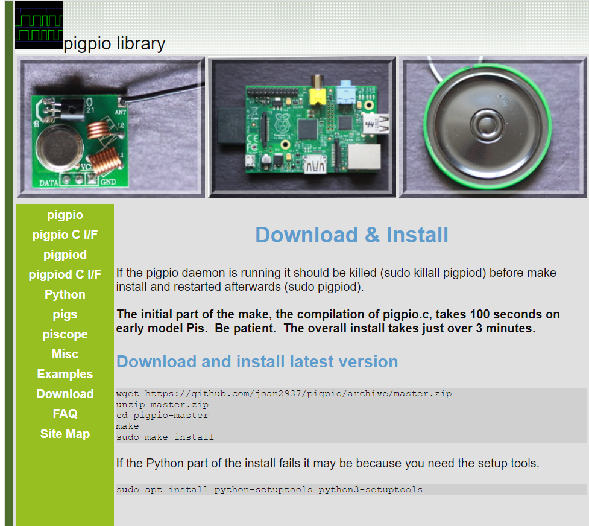
*Screenshot of Google Chrome webpage*

All commands seen on the webpage must be entered into the terminal of Raspberry Pi. 

<br>
Before starting the program to control the servos, you must activate the daemon from the terminal using this line stated below. Which also can be found on the webpage.

```
sudo pigpiod
```
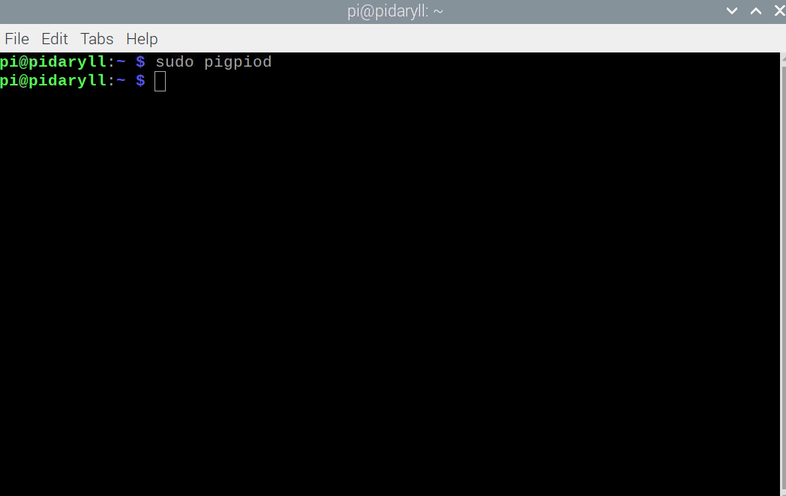
*Screenshot of Terminal in Raspberry Pi*

<br>


## How to start Maze Gui from Raspberry Pi terminal
### Run this file together with lightsensor_2 file


Enter these lines of code into the terminal to start the Laser Maze GUI

<br>

Used to change directory (which you have saved your own file under)
```
cd /home/pi/Desktop/gui32x32
```
Used to run file
```
python3 main_servo_gui.py
```
<br>

## How to start Light Sensor operation

Enter these lines of code into the terminal to start the Light Sensor program

<br>

Used to change directory (which you have saved your own file under)
```
cd /home/pi/Desktop/gui32x32
```
Used to run file
```
python3 lightsensor_2.py
```

<br>

# Final Look of GUI
## Start Up Page
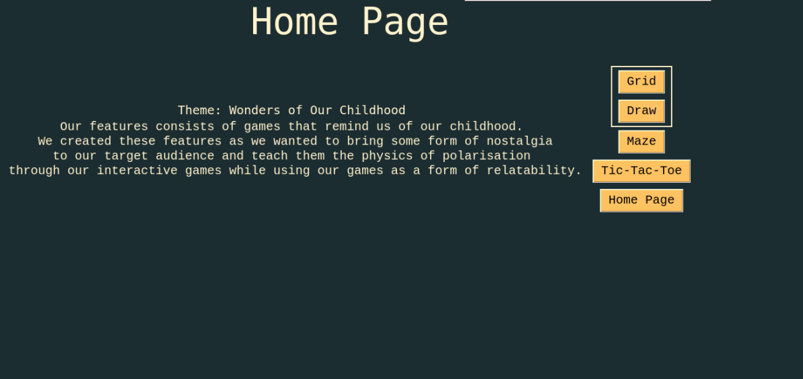
*Screenshot of the GUI*

## Grid GUI
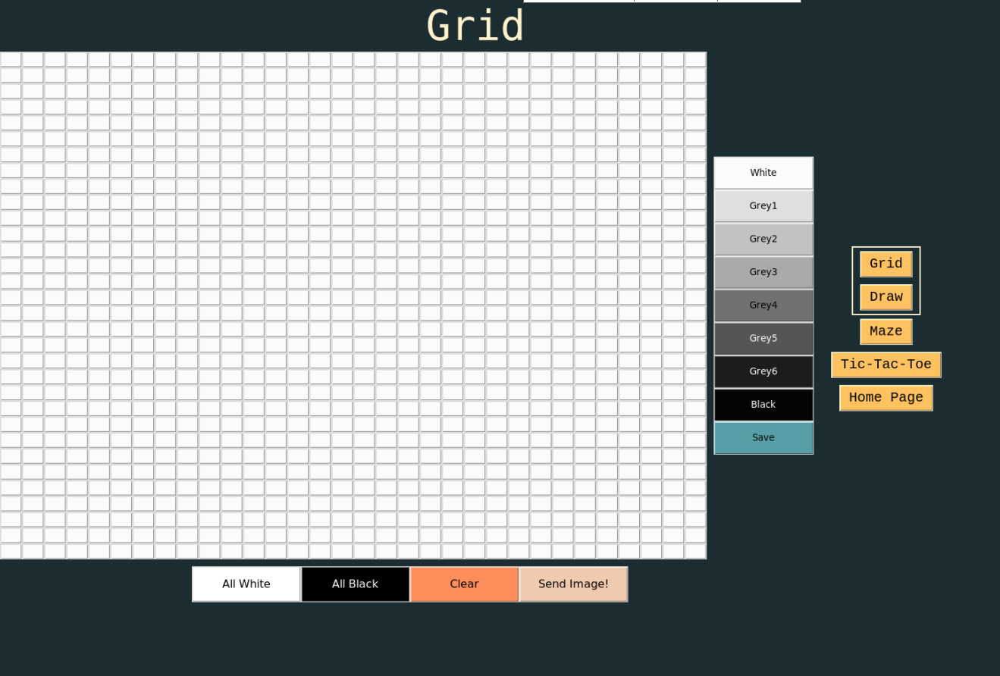
*Screenshot of the GUI*

## Draw GUI

*Screenshot of the GUI*

## Tic-Tac-Toe GUI

*Screenshot of the GUI*

## Laser Maze GUI
<br>
Each arrow button represents a change in servo angle by 15 degrees in the respective direction. Hence, pressing the left or right arrow button under each description (Motor1, Motor2, Polariser) will turn the servo motor in that specific direction.

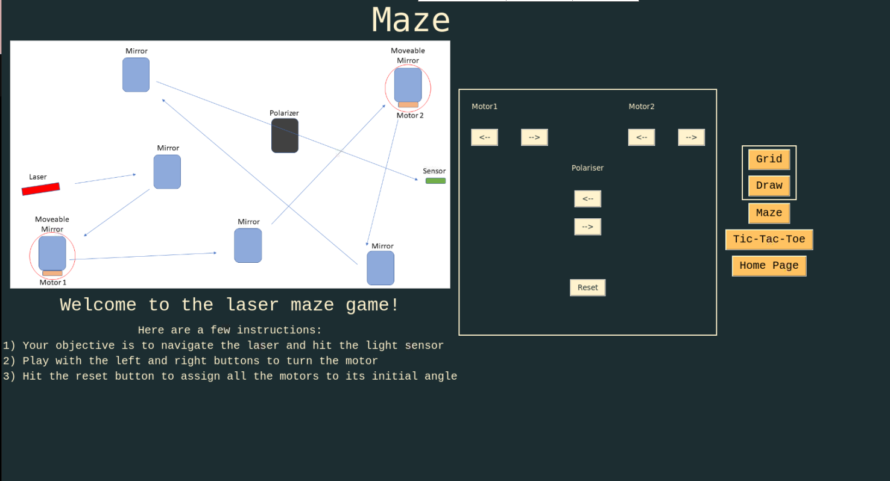
*Screenshot of the GUI*

# How to Run main GUI file on Terminal 
1. Open the terminal on raspberryPi.  
2. In the terminal, type the following commands: <br>
(This is assuming you saved the file under the 'Documents' folder)<br>
 ``` cd /home/pi/Documents ```
3. Once inside the directory folder of where your file is, type the following: <br>
``` python3 main.py``` 

 <br>
*Screenshot of terminal*

# Code for Light Sensor and Audio cue

```
import RPi.GPIO as GPIO
import time
import pygame
from student_pub import *


GPIO.setmode(GPIO.BOARD)

#define the pin that goes to the circuit
pin_to_circuit = 40

def rc_time (pin_to_circuit):
    count = 0
  
    #Output on the pin for 
    GPIO.setup(pin_to_circuit, GPIO.OUT)
    GPIO.output(pin_to_circuit, GPIO.LOW)
    time.sleep(0.1)

    #Change the pin back to input
    GPIO.setup(pin_to_circuit, GPIO.IN)
  
    #Count until the pin goes high
    while (GPIO.input(pin_to_circuit) == GPIO.LOW):
        count += 1


    if count > 0:
        pygame.mixer.init()
        pygame.mixer.music.load("clapping.wav")
        pygame.mixer.music.play()
        import sendimage
            
    return count

#Catch when script is interupted, cleanup correctly
try:
    #Main loop
    while True:
        
        print(rc_time(pin_to_circuit))
except KeyboardInterrupt:
    pass
finally:
    GPIO.cleanup()
```


<br>


# Code for Maze GUI
```
# Import required libraries
from gpiozero import AngularServo
from guizero import App, Slider, Text, ButtonGroup
from gpiozero.pins.pigpio import PiGPIOFactory

from tkinter import *
from PIL import ImageTk, Image
from tkinter.ttk import *
import tkinter.messagebox

# Create an instance of tkinter window
win = Tk()
style = Style()

factory = PiGPIOFactory()

win.title("Laser Maze")

# Define the geometry of the window
win.geometry("2000x1100")
# win.state('zoomed')

s = AngularServo(25, initial_angle = 0, min_pulse_width = 1/1000, max_pulse_width =2/1000
                , frame_width = 20/1000, pin_factory = factory, min_angle=-90, max_angle=90)

s1 = AngularServo(12 , initial_angle = 0, min_pulse_width = 1/1000, max_pulse_width =2/1000
                , frame_width = 20/1000, pin_factory = factory, min_angle=-90, max_angle=90)

s2 = AngularServo(24 , initial_angle = 75, min_pulse_width = 1/1000, max_pulse_width =2/1000
                , frame_width = 20/1000, pin_factory = factory, min_angle=-90, max_angle=90)

leftframe = Frame(win, width=200, height=200)
leftframe.grid(row=0, column=0)

rightframe = Frame(win, width=200, height=200)
rightframe.grid(row=0, column=1)

bottomframe = Frame(win, width=200, height=200)
bottomframe.grid(row=2, column=1)

# Create an object of tkinter ImageTk
img = ImageTk.PhotoImage(Image.open("diagram.png"))

label = Label(leftframe, image = img)
label.pack()

counter_s = 0
counter_s1 = 0
counter_s2 = 0

def subtract():
    global counter_s 
    counter_s -=15
    s.angle = 0 + counter_s
    s.angle = int(s.angle - 15) 
    print("motor1: ", s.angle)
    
    if s.angle == -90:
        counter_s = -90
    
def addition():
    
    global counter_s 
    counter_s  +=15
    s.angle = 0 + counter_s 
    print("motor1:", s.angle)
    
    if s.angle == 90.0:
        counter_s  = 90.0
        tkinter.messagebox.showinfo("You have reached the maximum angle")

def subtract2():
    global counter_s1 
    counter_s1 -=15
    s1.angle = 0 + counter_s1 
    #s.angle = int(s.angle - 15) 
    print("motor2: ", s1.angle)
    
    if s1.angle == -90.0:
        counter_s1 = -90.0
        print("You have reached the minimum angle")
    
def addition2():
    global counter_s1
    counter_s1 +=15
    s1.angle = 0 + counter_s1
    print("motor2:", s1.angle)
    
    if s1.angle == 90.0:
        counter_s1 = 90.0
        print("You have reached the maximum angle")

def subtract3():
    global counter_s2 
    counter_s2 -=15
    s2.angle = 0 + counter_s2 
    #s.angle = int(s.angle - 15) 
    print("Polariser: ", s2.angle)
    
    if s2.angle == -90.0:
        counter_s2 = -90.0
        print("You have reached the minimum angle")
    
def addition3():
    global counter_s2
    counter_s2 +=15
    s2.angle = 0 + counter_s2
    print("Polariser:", s2.angle)
    
    if s2.angle == 90.0:
        counter_s2 = 90.0
        print("You have reached the maximum angle")
        
def reset_motor():
    s.angle = 0.0
    s1.angle = 0.0
    s2.angle = 75.0
    print(s.angle,s1.angle,s2.angle)

welcome = Label(bottomframe, text ="Welcome to the laser maze game!", font=("Arial", 25)).grid(row=2, column=1)

instructions = Label(bottomframe, text= "Here are a few instructions: \n 1) Your objective is to navigate the laser and hit the light sensor,\n 2) Play with the left and right buttons to turn the motor,\n 3) Hit the reset button to assign all the motors to its initial angle"
, font= ("Courier", 15)).grid(row=3, column=1)

motor1 = Label(rightframe, text ="Motor1").grid(row=3, column=1, padx=20, pady=20)
btn1 = Button(rightframe, text = '<--', command = subtract)
btn1.grid(row = 4, column = 1, pady = 10, padx = 20)

btn2 = Button(rightframe, text = '-->', command = addition)
btn2.grid(row = 4, column = 2, pady = 10, padx = 20)

motor2 =Label(rightframe, text ="Motor2").grid(row=3,column=4, padx=20, pady=20)
btn3 = Button(rightframe, text = '<--', command = subtract2)
btn3.grid(row = 4, column = 4, pady = 10, padx = 20)

btn4 = Button(rightframe, text = '-->', command = addition2)
btn4.grid(row = 4, column = 5, pady = 10, padx = 20)

motor3 =Label(rightframe, text ="Polariser").grid(row=6,column=3, padx=20, pady=20)
btn5 = Button(rightframe, text = '<--', command = subtract3)
btn5.grid(row = 8, column = 3, pady = 10, padx = 20)

btn6 = Button(rightframe, text = '-->', command = addition3)
btn6.grid(row = 9, column = 3, pady = 10, padx = 20)

btn9 = Button(rightframe, text = 'Reset', command = reset_motor)
btn9.grid(row = 15, column = 3, pady = 70, padx = 20)

win.mainloop()
```

# Code for the Gui
```
from tkinter import *
from tkinter import messagebox
# from student_pub import *

def homefunc():
    tttframe.grid_forget()
    gndframe.grid_forget()
    contenttitle.grid(row=0, column=0)
    contenttxt.grid(row=1, column=0)

def gridfunc():
    global var 
    var = "Grid"
    title.config(text=var)

    contenttitle.grid_forget()
    contenttxt.grid_forget()

    tttframe.grid_forget()
    gndframe.grid(row=0, column=0)
    dframe.grid_forget()
    gframe.grid(row=0, column=0)

def drawfunc():
    global var 
    var = "Draw"
    title.config(text=var)

    contenttitle.grid_forget()
    contenttxt.grid_forget()

    tttframe.grid_forget()
    gndframe.grid(row=0, column=0)
    gframe.grid_forget()
    dframe.grid(row=0, column=0)

def tttfunc():
    global var 
    var = "Tic-Tac-Toe"
    title.config(text=var)
    
    contenttitle.grid_forget()
    contenttxt.grid_forget()
    
    gndframe.grid_forget()
    tttframe.grid(row=0, column=0)

def whitebtn(i, j):
    global colour

    if colour == 0:
      button[i][j].config(bg='grey99')
      value[i][j] = 0
    elif colour == 1: 
      button[i][j].config(bg='grey88')
      value[i][j] = 20
    elif colour == 2:
      button[i][j].config(bg='grey77')
      value[i][j] = 30
    elif colour == 3: 
      button[i][j].config(bg='grey66')
      value[i][j] = 40
    elif colour == 4:
      button[i][j].config(bg='grey44')  
      value[i][j] = 50
    elif colour == 5: 
      button[i][j].config(bg='grey33')
      value[i][j] = 60
    elif colour == 6:
      button[i][j].config(bg='grey22')
      value[i][j] = 70
    else: 
      button[i][j].config(bg='grey1')
      value[i][j] = 90

def change_colour(m): 
    global colour
    colour=m 

    print("colour is {}".format(colour))

def allwht():
    for j in range (32):
      for i in range (32):
        button[i][j].config(bg='grey99')
        value[i][j] = 0

def allblk():
    for j in range (32):
      for i in range (32):
        button[i][j].config(bg='grey1')
        value[i][j] = 90

def pattern():
    for j in range (32):
      for i in range (32):
        if i == j: 
          button[i][j].config(bg='grey66')
          value[i][j] = 40
        elif i + j == 31: 
          button[i][j].config(bg='grey66')
          value[i][j] = 40
        else:
          button[i][j].config(bg='grey99')
          value[i][j] = 0


def ramseq():
    for j in range (32):
      for i in range (32):
        if j < 6:
          button[i][j].config(bg='grey99')
          value[i][j] = 0
        elif j >= 6 and j <= 12:
          button[i][j].config(bg='grey88')
          value[i][j] = 20
        elif j >= 12 and j <= 18:
          button[i][j].config(bg='grey77')
          value[i][j] = 30
        elif j >= 18 and j <= 24:
          button[i][j].config(bg='grey66')
          value[i][j] = 40
        elif j >= 24 and j <= 32:
          button[i][j].config(bg='grey44')
          value[i][j] = 50 

###########################################################################################
def sendbtn():
    #print(value)
    print(canvasdraw)
    # pubpic(value)

def get_x_and_y(event):
   global lasx, lasy
   lasx, lasy = event.x, event.y

def paint(event):
    global lasx, lasy, value
    if lasx >= 0 and lasx <= 799 and lasy >= 0 and lasy <= 799:
      if colour == 0: 
          c.create_line((lasx,lasy, event.x, event.y),fill='grey99',width=4)
          canvasdraw[lasx][lasy] = 0
      elif colour == 1:
          c.create_line((lasx,lasy, event.x, event.y),fill='grey88',width=4)
          canvasdraw[lasx][lasy] = 1
      elif colour == 2:
          c.create_line((lasx,lasy, event.x, event.y),fill='grey77',width=4)
          canvasdraw[lasx][lasy] = 2
      elif colour == 3: 
          c.create_line((lasx,lasy, event.x, event.y),fill='grey66',width=4)
          canvasdraw[lasx][lasy] = 3
      elif colour == 4:
          c.create_line((lasx,lasy, event.x, event.y),fill='grey44',width=4)
          canvasdraw[lasx][lasy] = 4
      elif colour == 5: 
          c.create_line((lasx,lasy, event.x, event.y),fill='grey33',width=4)
          canvasdraw[lasx][lasy] = 5
      elif colour == 6:
          c.create_line((lasx,lasy, event.x, event.y),fill='grey22',width=4)
          canvasdraw[lasx][lasy] = 6
      else: 
          c.create_line((lasx,lasy, event.x, event.y),fill='grey11',width=4)
          canvasdraw[lasx][lasy] = 7
      get_x_and_y(event)

def scaledown(r, c):
    global lasx, lasy
    list = []
    for x in range(r, c):
      for y in range(r, c):
        list.append(canvasdraw[x][y])
    return list


def save_draw_colour(list):
  for r in range(32):
    for c in range(32):
      if list[r][c] == 0:
        button[r][c].config(bg='grey99')
        value[r][c] = 0
      elif list[r][c] == 1: 
        button[r][c].config(bg='grey88')
        value[r][c] = 20
      elif list[r][c] == 2:
        button[r][c].config(bg='grey77')
        value[r][c] = 30
      elif list[r][c] == 3: 
        button[r][c].config(bg='grey66')
        value[r][c] = 40
      elif list[r][c] == 4:
        button[r][c].config(bg='grey44')
        value[r][c] = 50  
      elif list[r][c] == 5: 
        button[r][c].config(bg='grey33')
        value[r][c] = 60
      elif list[r][c] == 6:
        button[r][c].config(bg='grey22')
        value[r][c] = 70
      else: 
        button[r][c].config(bg='grey1')
        value[r][c] = 90

def save_img():
    global list2, list1, value
    list2 = []
    list1 = []
    list3 = []
    list4 = []
    for i in range(0, 800, 25):
      list3 = []
      for t in range(0 , 800, 25):
        getnumber = f0(t, i) #getting the row downwards then col cause grid is store in the order row-column
        #print(i, t)
        list3.append(getnumber)
      list4.append(list3)
      #list3.append(list1)
    save_draw_colour(list4)
    print(list4)
  
def f0(x, y): #get the starting x, y of a 18x18 and to return 1 value back to rep the 18x18, to scale down a 18x18 to a 1x1
    global list0, list1, list2
    list = []
    #num1 = 18*(x-1)
    #num2 = num1 + 18
    for i in range(x ,25+x):
      for t in range(y ,25+y):
        list.append(canvasdraw[i][t])
    list0 = list
    freq = min(set(list0), key = list0.count) #using min instead cause if max almost everytime will get 0,harder for the draw to show; once the 18x18 grid got 1 value change, then return that value
                                              #Link: https://www.geeksforgeeks.org/python-find-most-frequent-element-in-a-list/
    #list1.append(freq)
    return freq 

def clearbtn():
    c.delete('all')
    allwht()
    for i in range(800):
        for j in range(800):
            canvasdraw[i][j] = 0

#########################################################################################

def changeto(m):
    global pattern
    pattern = m 
    # print("pattern is", pattern)

def tictaotoe(x,y):
    global pattern, xoff, yoff
    if x == 0 and y == 0:
        xoff = 0
        yoff = 0
    elif x == 0 and y == 1:
        xoff = 0
        yoff = 12
    elif x == 0 and y == 2:
        xoff = 0
        yoff = 24
    elif x == 1 and y == 0:
        xoff = 12
        yoff = 0 
    elif x == 1 and y == 1: 
        xoff = 12
        yoff = 12
    elif x == 1 and y == 2: 
        xoff= 12
        yoff = 24 
    elif x == 2 and y == 0: 
        xoff = 24
        yoff = 0 
    elif x == 2 and y == 1: 
        xoff = 24
        yoff = 12 
    else: 
        xoff = 24
        yoff = 24

    if pattern == 0: 
        var = "X"
        gui[x][y].config(text=var)
        condition(logic(var))
        print(logic(var))
        for i in range (32):
            for j in range (32):
                if i == xoff and j == yoff: 
                        value[i][j] = 7
                        btn[i][j].config(bg="black")
                elif i == xoff + 1 and j == yoff + 1: 
                        value[i][j] = 7
                        btn[i][j].config(bg="black")
                elif i == xoff + 2 and j == yoff + 2: 
                        value[i][j] = 7
                        btn[i][j].config(bg="black")
                elif i == xoff + 3 and j == yoff + 3: 
                        value[i][j] = 7
                        btn[i][j].config(bg="black")
                elif i == xoff + 4 and j == yoff + 4: 
                        value[i][j] = 7
                        btn[i][j].config(bg="black")
                elif i == xoff + 5 and j == yoff + 5: 
                        value[i][j] = 7
                        btn[i][j].config(bg="black")
                elif i == xoff + 6 and j == yoff + 6: 
                        value[i][j] = 7
                        btn[i][j].config(bg="black")
                elif i == xoff + 7 and j == yoff + 7: 
                        value[i][j] = 7
                        btn[i][j].config(bg="black")
                elif i == xoff and j == yoff + 7: 
                        value[i][j] = 7
                        btn[i][j].config(bg="black")
                elif i == xoff + 1 and j == yoff + 6: 
                        value[i][j] = 7
                        btn[i][j].config(bg="black")
                elif i == xoff + 2 and j == yoff + 5: 
                        value[i][j] = 7
                        btn[i][j].config(bg="black")
                elif i == xoff + 3 and j == yoff + 4: 
                        value[i][j] = 7
                        btn[i][j].config(bg="black")
                elif i == xoff + 4 and j == yoff + 3: 
                        value[i][j] = 7
                        btn[i][j].config(bg="black")
                elif i == xoff + 5 and j == yoff + 2: 
                        value[i][j] = 7
                        btn[i][j].config(bg="black")
                elif i == xoff + 6 and j == yoff + 1: 
                        value[i][j] = 7
                        btn[i][j].config(bg="black")
                elif i == xoff + 7 and j == yoff: 
                        value[i][j] = 7
                        btn[i][j].config(bg="black")
                

    else:
        var = "O"
        gui[x][y].config(text=var)
        condition(logic(var))
        print(logic(var))
        for i in range (32):
            for j in range (32):
                if j == 1 + yoff: 
                    if i == 2 + xoff: 
                        value[i][j] = 7
                        btn[i][j].config(bg="black")
                    elif i == 3 + xoff: 
                        value[i][j] = 7
                        btn[i][j].config(bg="black")
                    elif i == 4 + xoff: 
                        value[i][j] = 7
                        btn[i][j].config(bg="black")
                    elif i == 5 + xoff: 
                        value[i][j] = 7
                        btn[i][j].config(bg="black")
                elif j == 6 + yoff: 
                    if i == 2 + xoff: 
                        value[i][j] = 7
                        btn[i][j].config(bg="black")
                    elif i == 3 + xoff: 
                        value[i][j] = 7
                        btn[i][j].config(bg="black")
                    elif i == 4 + xoff: 
                        value[i][j] = 7
                        btn[i][j].config(bg="black")
                    elif i == 5 + xoff: 
                        value[i][j] = 7
                        btn[i][j].config(bg="black")
                elif i == 1 + xoff: 
                    if j == 2 + yoff: 
                        value[i][j] = 7
                        btn[i][j].config(bg="black")
                    elif j == 3 + yoff: 
                        value[i][j] = 7
                        btn[i][j].config(bg="black")
                    elif j == 4 + yoff: 
                        value[i][j] = 7
                        btn[i][j].config(bg="black")
                    elif j == 5 + yoff: 
                        value[i][j] = 7
                        btn[i][j].config(bg="black")
                elif i == 6 + xoff: 
                    if j == 2 + yoff: 
                        value[i][j] = 7
                        btn[i][j].config(bg="black")
                    elif j == 3 + yoff: 
                        value[i][j] = 7
                        btn[i][j].config(bg="black")
                    elif j == 4 + yoff: 
                        value[i][j] = 7
                        btn[i][j].config(bg="black")
                    elif j == 5 + yoff: 
                        value[i][j] = 7
                        btn[i][j].config(bg="black")

    # student_pub.pubpic(value)
    # logic(x,y)

def check():
    global p
    for x in range (3):
        for y in range (3):
            if (gui[x][y].cget('text') == 'X' or gui[x][y].cget('text') == 'O'):
                p = p+1

def logic(y):
    global p
    p = 0
    check()
    print(p)
    if      ((gui[0][0].cget('text') == y and gui[0][1].cget('text') == y and gui[0][2].cget('text') == y) or
			(gui[1][0].cget('text') == y and gui[1][1].cget('text') == y and gui[1][2].cget('text') == y) or
			(gui[2][0].cget('text') == y and gui[2][1].cget('text') == y and gui[2][2].cget('text') == y) or
			(gui[0][0].cget('text') == y and gui[1][0].cget('text') == y and gui[2][0].cget('text') == y) or
			(gui[0][1].cget('text') == y and gui[1][1].cget('text') == y and gui[2][1].cget('text') == y) or
			(gui[0][2].cget('text') == y and gui[1][2].cget('text') == y and gui[2][2].cget('text') == y) or
			(gui[0][0].cget('text') == y and gui[1][1].cget('text') == y and gui[2][2].cget('text') == y) or
			(gui[0][2].cget('text') == y and gui[1][1].cget('text') == y and gui[2][0].cget('text') == y)):
            return y
    elif (p >= 9):
        c = 'c'
        return c
    else:  
        return N
    

def condition(var):
    if var == "O": 
        messagebox.showinfo("Winner", "Player 1 won the match")
    elif var == "X": 
        messagebox.showinfo("Winner", "Player 2 won the match")
    elif var == 'c': 
        messagebox.showinfo("TIE", "tie game")


def clear():
    for i in range (32):
        for j in range (32):
            btn[i][j].config(bg="white")
            value[i][j] = 0

    for x in range(3):
        for y in range(3):
            gui[x][y].config(text='')

    print("Clear All")
    border()

def border(): 
    print("Borders")
    for j in range (32):
        for i in range (32):
            if i == 8: 
                value[i][j] = 7
            elif i == 9: 
                value[i][j] = 7
            elif i == 10: 
                value[i][j] = 7
            elif i == 11: 
                value[i][j] = 7
            elif i == 20: 
                value[i][j] = 7
            elif i ==  21: 
                value[i][j] = 7
            elif i == 22: 
                value[i][j] = 7
            elif i == 23: 
                value[i][j] = 7
            elif j == 8: 
                value[i][j] = 7
            elif j == 9: 
                value[i][j] = 7
            elif j == 10: 
                value[i][j] = 7
            elif j == 11: 
                value[i][j] = 7
            elif j == 20: 
                value[i][j] = 7
            elif j ==  21: 
                value[i][j] = 7
            elif j == 22: 
                value[i][j] = 7
            elif j == 23: 
                value[i][j] = 7
            else:
                value[i][j] = 0

#################################################################################################
main = Tk()
# main.state('zoom')

titleframe = Frame(main)
titleframe.grid(row=0, columnspan=1)
contentframe = Frame(main)
contentframe.grid(row=1, column=0)
modeframe = Frame(main)
modeframe.grid(row=1, column=1, pady=15)


#title for different mode
var = "Welcome!!!"
titlefont = ("Fixedsys", 25)
title = Label(titleframe, text=var, font=titlefont, fg="#a5678e")
title.grid(row=0, column=0)

# content 
explaination = Frame(contentframe)
explaination.grid(row=0, column=0)

contenttitle = Label(explaination, text="Theme: Wonders of Our Childhood", font=("Fixedsys", 15))
contenttitle.grid(row=0, column=0)
contenttxt = Label(explaination, text="""Our features consists of games that remind us of our childhood.
 We created these features as we wanted to bring some form of nostalgia
 to our target audience and teach them the physics of polarisation 
 through our interactive games while using our games as a form of relatability.""", font=("Courier", 15))
contenttxt.grid(row=1, column=0)

#mode 
modefont = ("Courier", 15)

default = Button(modeframe, text="Grid", font=modefont, bg="#97d2e1", command=gridfunc)
default.grid(row=0, column=0, padx=5, pady=5)
draw = Button(modeframe, text="Draw", font=modefont, bg="#ebbbbd", command=drawfunc)
draw.grid(row=1, column=0, padx=5, pady=5)
ttt = Button(modeframe, text="Tic-Tac-Toe", font=modefont, bg="#f5d788", command=tttfunc)
ttt.grid(row=2, column=0, padx=5, pady=5)
start = Button(modeframe, text="Home Page", font=modefont, bg="#9b9655", command=homefunc)
start.grid(row=3, column=0, padx=5, pady=5)

############################################ GRID 
gndframe = Frame(contentframe)

gframe = Frame(gndframe)
gframe.grid(row=0, column=0)

gndframe2 = Frame(gndframe) #shades btn
gndframe2.grid(row=0, column=1)
gndframe3 = Frame(gndframe)
gndframe3.grid(row=1, columnspan=2) #colour btns 
gndframe4 = Frame(gndframe)
gndframe4.grid(row=2, columnspan=2) #send btn

# 32x32 grid
button = [[j for j in range(32)] for i in range(32)]
value = [[0 for i in range(32)] for j in range(32)]

for j in range (32):
  for i in range (32):
    button[i][j] = Button(gframe, font=("Calibri, 5"), width=1, height=1, bg='white', command=lambda r=i, c=j:whitebtn(r, c))
    button[i][j].grid(row=i, column=j)

#shades button
white = Button(gndframe2, text="White", font=("Calibri, 10"), bg='grey99', width=13, height=2, command=lambda m=0:change_colour(m))
white.grid(row=1, column=0)
grey1 = Button(gndframe2, text="Grey1", font=("Calibri, 10"), bg='grey88', width=13, height=2, command=lambda m=1:change_colour(m))
grey1.grid(row=2, column=0)
grey2 = Button(gndframe2, text="Grey2", font=("Calibri, 10"), bg='grey77', width=13, height=2, command=lambda m=2:change_colour(m))
grey2.grid(row=3, column=0)
grey3 = Button(gndframe2, text="Grey3", font=("Calibri, 10"), bg='grey66', width=13, height=2, command=lambda m=3:change_colour(m))
grey3.grid(row=4, column=0)
grey4 = Button(gndframe2, text="Grey4", font=("Calibri, 10"), bg='grey44', width=13, height=2, command=lambda m=4:change_colour(m))
grey4.grid(row=5, column=0)
grey5 = Button(gndframe2, text="Grey5", font=("Calibri, 10"), bg='grey33', fg='white', width=13, height=2, command=lambda m=5:change_colour(m))
grey5.grid(row=6, column=0)
grey6 = Button(gndframe2, text="Grey6", font=("Calibri, 10"), bg='grey11', fg='white', width=13, height=2, command=lambda m=6:change_colour(m))
grey6.grid(row=7, column=0)
black = Button(gndframe2, text="Black", font=("Calibri, 10"), bg='grey1', fg='white', width=13, height=2, command=lambda m=7:change_colour(m))
black.grid(row=8, column=0)

#save button
savebtn = Button(gndframe2, text="Save", font=("Calibri, 10"), bg='light blue', fg='black', width=13, height=2, command=save_img)
savebtn.grid(row=9, column=0)

#colour button
allwhite = Button(gndframe3, text="All White",font=("Calibri, 12"), bg='white', width=13, height=2, command=allwht)
allwhite.grid(row=0, column=0)

allblack = Button(gndframe3, text="All Black",font=("Calibri, 12"), bg='black', fg='white', width=13, height=2, command=allblk)
allblack.grid(row=0, column=1)

clear = Button(gndframe3, text="Clear",font=("Calibri, 12"), bg='gold', width=13, height=2, command=clearbtn)
clear.grid(row=0, column=2)

#send btn
send = Button(gndframe4, text="Send Image!", font=("Calibri, 12"), width=13, height=2, command=lambda :sendbtn())
send.grid(row=0, column=0)

############################################### DRAW
dframe = Frame(gndframe)
dframe.grid(row=0, column=0)

c = Canvas(dframe, width=800, height=800, bg='white')  
c.grid(row=0, column=0)

c.bind('<Button-1>', get_x_and_y)
c.bind('<B1-Motion>',paint)
c.bind('<Enter>', get_x_and_y)

#this variable to store the colour choice 
colour = 0
canvasdraw = [[0 for i in range(800)] for j in range(800)]  # save eventxy into an array 


###################################### TIC-TAC-TOE
tttframe = Frame(contentframe)

tttframe1 = Frame(tttframe)
tttframe1.grid(rowspan=2, column=0)

btn = [[i for i in range (32)] for j in range (32)]
for i in range (32):
    for j in range (32):
        btn[i][j] = Button(tttframe1, font=("Calibri, 5"), width=1, height=1, bg="white")
        btn[i][j].grid(row=i, column=j)

tttframe2 = Frame(tttframe)
tttframe2.grid(row=0, column=1, padx=15)

value = [[0 for i in range(32)] for j in range(32)]

gui = [[x for x in range(3)] for y in range(3)]

for x in range (3):
    for y in range (3):
        gui[x][y] = Button(tttframe2, font=("Calibri, 5"), width=18, height=12, command=lambda r=x, c=y:tictaotoe (r, c))
        gui[x][y].grid(row=x, column=y)

tttframe3 = Frame(tttframe)
tttframe3.grid(row=1, column=1)

ximg = PhotoImage(file="x.png")
oimg = PhotoImage(file="o.png")

xoff = 0
yoff = 0
pattern = 0 
p = 0

obtn = Button(tttframe3, text="", image=oimg, command=lambda m=1:changeto(m))
obtn.grid(row=0, column=0)
xbtn = Button(tttframe3, text="", image=ximg, command=lambda m=0:changeto(m))
xbtn.grid(row=0, column=1)

p1 = Label(tttframe3, text="Player 1 is O", font=("Courier", 10))
p1.grid(row=2, columnspan=2)
p2 = Label(tttframe3, text="Player 2 is X", font=("Courier", 10))
p2.grid(row=3, columnspan=2)

clearbtn = Button(tttframe3, text="Clear", font=("Courier", 15), command=clear)
clearbtn.grid(row=1, columnspan=2)

# student_pub.pubpic(value)
main.mainloop()
```