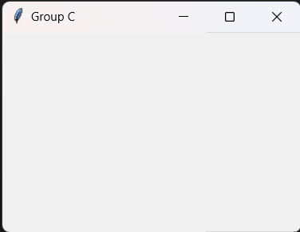

# 32 x 32 GUI Documentation 
This documentation is an introduction about the 32 x 32 GUI and its features. 

# Setting Up The GUI
To create a tkinter GUI, we need to import the tkinter library 
```
from tkinter import *
```

To create a window with our group title  
```
main = Tk()
main.title("Group C")
```

For the window to stay on the screen, we need to loop it. 
```
main.mainloop()
```

Output <br>


# Create 32 x 32 Buttons
To create the 32x32 buttons, list of list is required. 
```
button = [[j for j in range(32)] for i in range(32)]

for j in range (32):
  for i in range (32):
    button[i][j] = Button(frame1, font=("Calibri, 5"), width=1, height=1, command=lambda r=i, c=j:whitebtn(r, c))
    button[i][j].grid(row=i, column=j)
```
Output <br>


# Frame Function
The frame function is to group and organise the widget so that it is user friendly.

```
frame1 = Frame(main) #32x32 grid
frame1.grid(row=0, column=0)
```
Frame1 is to indicate the first frame which is for the 32x32 grid.


# Create Shades Buttons
Sample codes to create shades buttons. 
```
white = Button(frame2, text="White", font=("Calibri, 10"), width=13, height=2)
white.grid(row=0, column=0)
```

Output <br>


# Features Button 

Output <br>


# The Final Output of GUI 
