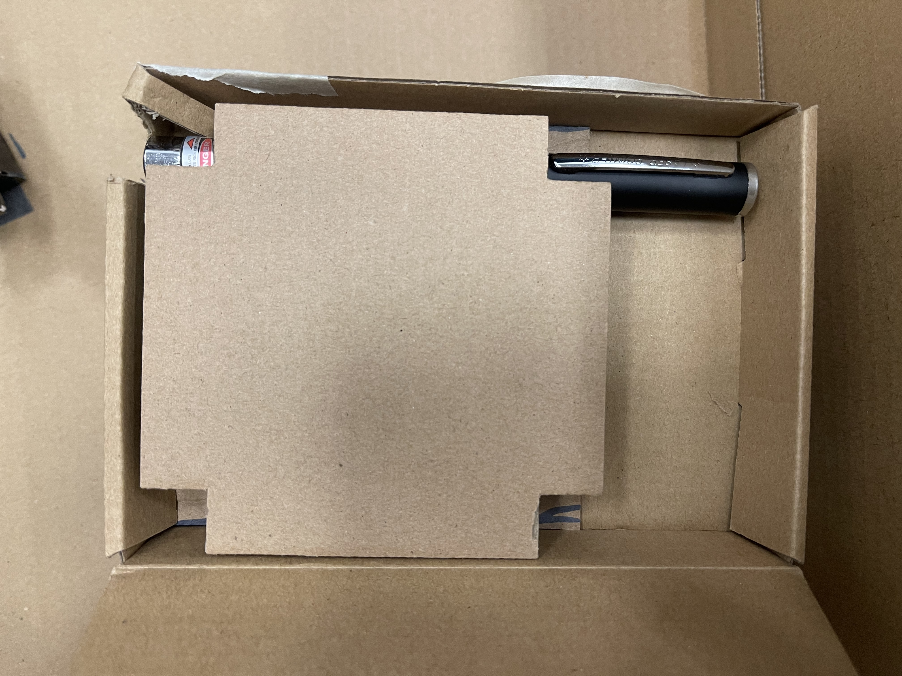
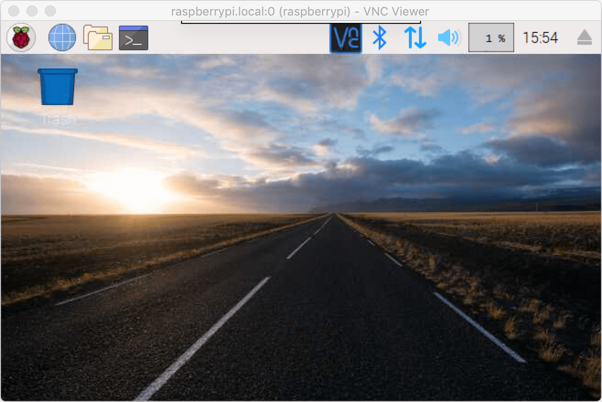
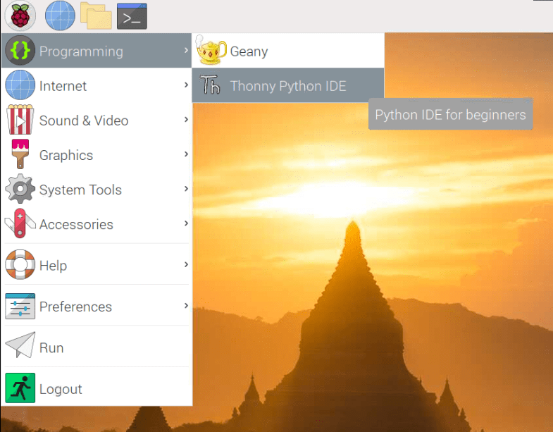
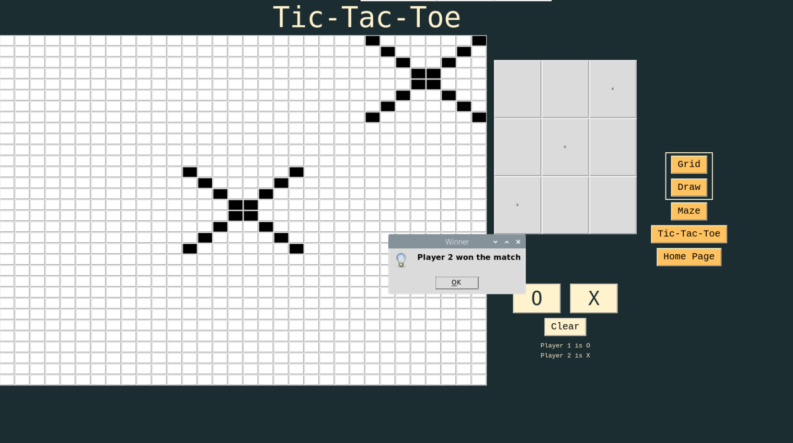
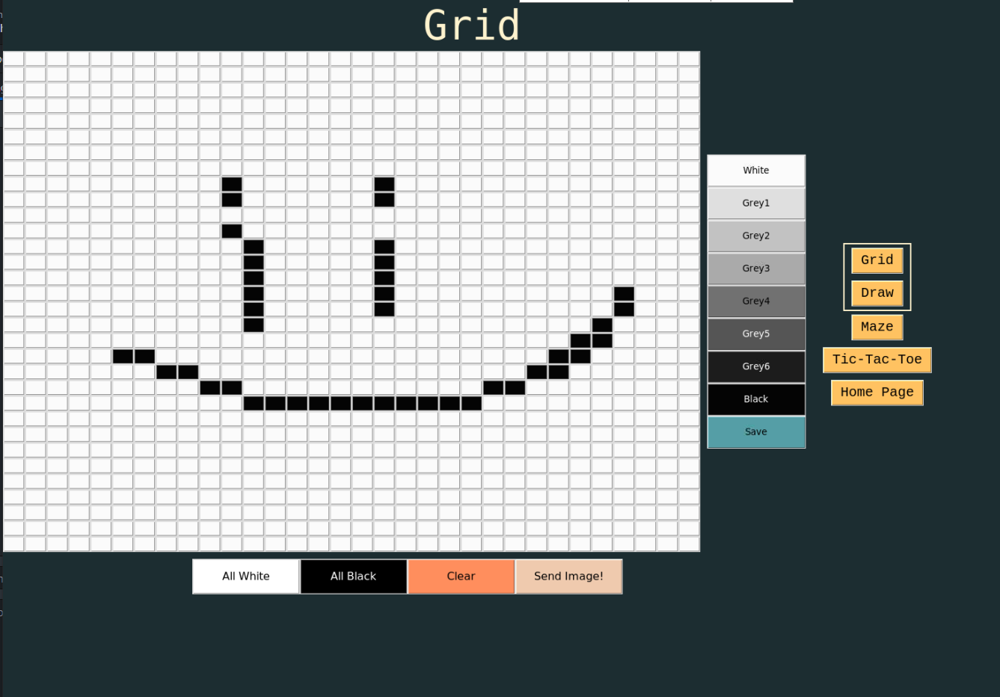
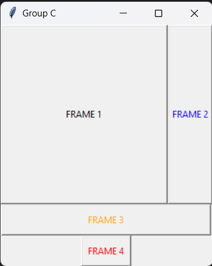

# Table of Content
1. Project Introduction

2. System Diagram

3. Flowchart

4. Installation of Software & Hardware

5. Setting up Raspberry Pi

6. Start up page

7. Features
- Tic Tac Toe
- Drawing
- Laser Maze

9. Running program from terminal

10. All pages within program


## 32x32, Wonders of Our Childhood
This documentation is an introduction about the 32 x 32 GUI and it's features. The purpose of this GUI is to control the polarised motor to display a pixelated image. Users can choose from an array of different shades of grey as well as preset patterns to play with the GUI. 

Example of the pixelated image. <br>

 <br>
*Fu Yongwei, EGL314 - Lecture 1 Module Introduction*

## Project Learning Point
We want to showcase to our target audience about the physics of polarisation  
and brewster angle through our interactive games. And why these particular features?
Because there is some form of nostalgia as these are games we have played at least 
once during our childhood which also adds relatability to our audience. 
<br>
## Project Backsory
Behind these arcade games, there is always something to learn behind the scenes 
and we wanna tell them how interesting and cool it is. How they are made better with inovation and how the may be relatively complex to build.

<br>

## Research? 

<br>

## System Diagram of Hardware and Software


*Fu Yongwei, huats-club/EGL314starterkit* <br>
*Credit: https://github.com/huats-club/EGL314starterkit*

## Code Flowchart

*Code Flow Chart*

# Installation of Software and Hardware
## Hardware
**Model** : RaspberryPi 4 Model B <br>
**OS Version** : Raspbian GNU/Linux 10 (buster) <br>

 <br>
*Fu Yongwei, EGL314 - Lecture 1 Module Introduction*

## Installation for maze
The laser maze consist of 3 SG90 servos, 6 mirrors, breadboard, RaspberryPi, laser, jumperwires, photodiode sensor, 2 polarizers.<br>
2 mirrors and 1 polarizer is attacted to the each of the servo to make it movable to direct the laser to the sensor. 

The cardboard used as a base for the maze is 65cm x 45cm
 <br>
*Image of the cardboard used for the maze*

The box that is used to hold the laser is 17cm x 12cm
 <br> 


<br>

## Software 
1. PuTTy
2. Advanced Port Scanner
3. VNC Viewer
4. Pi GPIO Library

## PuTTy 
PuTTy allows free implementation of SSH for PCs running Microsoft Windows. After installing PuTTy, enter the hostname "raspberrypi".<br>

 <br>
*Credit: https://tutorials-raspberrypi.com/raspberry-pi-remote-access-by-using-ssh-and-putty/*


## Advanced Port Scanner
Use Advanced Port Scanner to scan your network ip address in order to connect to VNC Viewer. Click "Start" to scart scanning. 

 <br>
*Screenshot of Advanced Port Scanner* <br>

## VNC Viewer
Next, open VNC Viewer. Enter your Raspberry Pi ip address to remotely access the desktop of your Raspberry Pi over the internet.

 <br>
*Screenshot of VNC Viewer*

This step is to create new connection for raspberry pi. 

*Screenshot of VNC Viewer*

Enter the username and password for the raspberry pi login and press "OK". 


*Credit: https://www.pitunnel.com/doc/access-vnc-remote-desktop-raspberry-pi-over-internet*

The VNC session should start, and you should see your Raspberry Pi desktop.


*Credit: https://www.pitunnel.com/doc/access-vnc-remote-desktop-raspberry-pi-over-internet*


To start coding, click on the raspberry pi logo and under Programming, look for Thonny Python IDE and click on it.


*Credit: https://roboticsbackend.com/thonny-ide-raspberry-pi-os/*

<br>

## Pi GPIO Library
Go to this link to view all commands to install the PiGPIOd library, reduces jitter on servo motor
<br>*Credit: http://abyz.me.uk/rpi/pigpio/download.html*<br>
Code used to install Library as shown in image, enter in Terminal of Raspberry Pi
```
wget https://github.com/joan2937/pigpio/archive/master.zip
unzip master.zip
cd pigpio-master
make
sudo make install
```


*Screenshot of Google Chrome webpage*

Before starting the program to control the servos, you must activate the daemon from the terminal.

```
sudo pigpiod
```


*Screenshot of Terminal in Raspberry Pi*

# Setting up the Raspberry Pi
Note: Only do the following on first initial boot.

After you entered the hostname, click "open" and a command prompt window should appear. Enter your username and password here. The Raspbian default login is user “pi” with password “raspberry“.

 <br>
*Credit: https://librarymakers.net/using-cli-raspberry-pi*

You may change your password with the following command: ```sudo passwd```

### 1. Update Raspberry pi
Once logged in, update the Raspberry Pi. 
```
sudo apt update
sudo apt upgrade
```
### 2. Configuring Raspberry pi
### Enable SSH <br>
SSH is a is a network protocol that gives users, particularly system administrators, a secure way to access a computer over an unsecured network. To enable SSH type the following,
```
sudo raspi-config
```
Select ```3 Interface Options```<br>
Select ```P2 SSH```<br>
Select **Enable SSH**

### Enable Virtual Network Computing (VNC) <br>
VNC is a cross-platform screen sharing system that was created to remotely control another computer. To enable VNC, open terminal on your Raspberry Pi and try the following. 
```
sudo raspi-config
```
Select ```3 Interface Options```<br>
Select ```P3 VNC```<br>
Select **Enable VNC**

<br>

# Setting Up The GUI
To create a tkinter GUI, we need to import the tkinter library. 
```
from tkinter import *
```
To create a window with our group title. 
```
main = Tk()
main.title("Group C")
```

For the window to stay on the screen, we need to loop it. 
```
main.mainloop()
```

Output <br>

 <br>
*Screenshot of a sample window*

# Features
## Feature 1
### TicTacToe

Feature 1 is the classic TicTacToe game. You can choose to be either Player 1 or Player 2 based on selecting the X or O symbol as shown in the interface below.


*Screenshot of TicTacToe page in GUI*

<br>
This section of code is to build the grid and buttons, arrange them as well.

```
tttframe = Frame(contentframe)

tttframe1 = Frame(tttframe)
tttframe1.grid(rowspan=2, column=0)

btn = [[i for i in range (32)] for j in range (32)]
for i in range (32):
    for j in range (32):
        btn[i][j] = Button(tttframe1, font=("Calibri, 5"), width=1, height=1, bg="white")
        btn[i][j].grid(row=i, column=j)

tttframe2 = Frame(tttframe)
tttframe2.grid(row=0, column=1, padx=15)

value = [[0 for i in range(32)] for j in range(32)]

gui = [[x for x in range(3)] for y in range(3)]

for x in range (3):
    for y in range (3):
        gui[x][y] = Button(tttframe2, font=("Calibri, 5"), width=18, height=12, command=lambda r=x, c=y:tictaotoe (r, c))
        gui[x][y].grid(row=x, column=y)

tttframe3 = Frame(tttframe)
tttframe3.grid(row=1, column=1)
```
<br>
This scenario is when O wins the game


*Screenshot of TicTacToe page in GUI*

<br>

This scenario is when X wins the game



*Screenshot of TicTacToe page in GUI*

<br>

## Feature 2
### Draw

Feature 2 is a drawing feature, users can press and hold the left click of a mouse or trackpad to draw whatever image they wish. Then have it converted to grid form.


*Screenshot of Draw page in GUI*

<br>
This line of code creates the canvas to draw on and stores selected colour.

```
dframe = Frame(gndframe)
dframe.grid(row=0, column=0)

c = Canvas(dframe, width=800, height=800, bg='white')  
c.grid(row=0, column=0)

c.bind('<Button-1>', get_x_and_y)
c.bind('<B1-Motion>',paint)
c.bind('<Enter>', get_x_and_y)

#this variable to store the colour choice 
colour = 0
canvasdraw = [[0 for i in range(800)] for j in range(800)]  # save eventxy into an array 

```

<br>
This is how it looks like when a user draws on the canvas


*Screenshot of Draw page in GUI*

<br>
This is how the drawing looks when the user Saves it then changes it to grid form.


*Screenshot of Draw page in GUI*

<br>

## Feature 3
### Laser Maze

Feature 3 is a Laser Maze which users need to navigate through. Starting from the laser pointer at a fixed position shinning into a mirror. The user's task is the redirect the laser using the GUI that controls servo motors which have mirrors and a polariser attatched to them to reflect the beam into a sensor at the end in order to win the game.

<br>

This is the Laser Maze controls on the GUI


*Screenshot of Laser Maze page on the GUI*

<br>

This line of code is the starting settings of the motors upon starting the python file

```
s = AngularServo(25, initial_angle = 0, min_pulse_width = 1/1000, max_pulse_width =2/1000
                , frame_width = 20/1000, pin_factory = factory, min_angle=-90, max_angle=90)

s1 = AngularServo(12 , initial_angle = 0, min_pulse_width = 1/1000, max_pulse_width =2/1000
                , frame_width = 20/1000, pin_factory = factory, min_angle=-90, max_angle=90)

s2 = AngularServo(24 , initial_angle = 75, min_pulse_width = 1/1000, max_pulse_width =2/1000
                , frame_width = 20/1000, pin_factory = factory, min_angle=-90, max_angle=90)

```

This line of code is the calculation of the angles when pushing the buttons on the GUI to turn the motors. And to reset the motors to a preset angle.

```
counter_s = 0
counter_s1 = 0
counter_s2 = 0

def subtract():
    global counter_s 
    counter_s -=15
    s.angle = 0 + counter_s
    s.angle = int(s.angle - 15) 
    print("motor1: ", s.angle)
    
    
    if s.angle == -90:
        counter_s = -90
        
    
#     s1.angle = int(slider1.value)
#     print("motor2: ",s1.angle)
    
def addition():
    
    global counter_s 
    counter_s  +=15
    s.angle = 0 + counter_s 
    print("motor1:", s.angle)
    
    if s.angle == 90.0:
        counter_s  = 90.0
        tkinter.messagebox.showinfo("You have reached the maximum angle")


def subtract2():
    global counter_s1 
    counter_s1 -=15
    s1.angle = 0 + counter_s1 
    #s.angle = int(s.angle - 15) 
    print("motor2: ", s1.angle)
    
    
    if s1.angle == -90.0:
        counter_s1 = -90.0
        print("You have reached the minimum angle")
    
    #s1.angle = int(slider1.value)
    #print("motor2: ",s1.angle)
    
def addition2():
    global counter_s1
    counter_s1 +=15
    s1.angle = 0 + counter_s1
    print("motor2:", s1.angle)
    
    if s1.angle == 90.0:
        counter_s1 = 90.0
        print("You have reached the maximum angle")

def subtract3():
    global counter_s2 
    counter_s2 -=15
    s2.angle = 0 + counter_s2 
    #s.angle = int(s.angle - 15) 
    print("Polariser: ", s2.angle)
    
    
    if s2.angle == -90.0:
        counter_s2 = -90.0
        print("You have reached the minimum angle")
    
    #s1.angle = int(slider1.value)
    #print("motor2: ",s1.angle)
    
def addition3():
    global counter_s2
    counter_s2 +=15
    s2.angle = 0 + counter_s2
    print("Polariser:", s2.angle)
    
    if s2.angle == 90.0:
        counter_s2 = 90.0
        print("You have reached the maximum angle")
        
        
def reset_motor():
    s.angle = 0.0
    s1.angle = 0.0
    s2.angle = 75.0
    print(s.angle,s1.angle,s2.angle)
```


<br>

# Frame Function
We are using the frame function to group and organize the widget to make it neater so that it is user friendly.

Frame1 is to indicate the first frame for the 32x32 grid.
```
frame1 = Frame(main)
frame1.grid(row=0, column=0)
```
Frame2 is to indicate the second frame for the shades buttons. 
```
frame2 = Frame(main) 
frame2.grid(row=0, column=1)
```
Frame 3 is to indicate the third frame for the preset buttons. 
```
frame3 = Frame(main)
frame3.grid(row=1, columnspan=2)
```
Frame4 is to indicate the fourth frame for the send button. 
```
frame4 = Frame(main)
frame4.grid(row=2, columnspan=2)
```
Output <br>

 <br>
*Screenshot of a frame window*


# Create 32 x 32 Buttons
We are using a list of list and nested for loop to create a 32 x 32 buttons. 
```
button = [[j for j in range(32)] for i in range(32)]

for j in range (32):
  for i in range (32):
    button[i][j] = Button(frame1, font=("Calibri, 5"), width=1, height=1, bg='white')
    button[i][j].grid(row=i, column=j)
```
Output <br>

 <br>
*Screenshot of  32x32 grid from final output*

# Create Shades Buttons
Below is the codes to create shades buttons. Change the text and background colour accordingly to get different shades buttons. 
```
white = Button(frame2, text="White", font=("Calibri, 10"), bg='grey99', width=13, height=2)
white.grid(row=0, column=0)

grey1 = Button(frame2, text="Grey1", font=("Calibri, 10"), bg='grey88', width=13, height=2)
grey1.grid(row=1, column=0)

grey2 = Button(frame2, text="Grey2", font=("Calibri, 10"), bg='grey77', width=13, height=2)
grey2.grid(row=2, column=0)

grey3 = Button(frame2, text="Grey3", font=("Calibri, 10"), bg='grey66', width=13, height=2)
grey3.grid(row=3, column=0)

grey4 = Button(frame2, text="Grey4", font=("Calibri, 10"), bg='grey44', width=13, height=2)
grey4.grid(row=4, column=0)

grey5 = Button(frame2, text="Grey5", font=("Calibri, 10"), bg='grey33', fg='white', width=13, height=2)
grey5.grid(row=5, column=0)

grey6 = Button(frame2, text="Grey6", font=("Calibri, 10"), bg='grey11', fg='white', width=13, height=2)
grey6.grid(row=6, column=0)

black = Button(frame2, text="Black", font=("Calibri, 10"), bg='grey1', fg='white', width=13, height=2)
black.grid(row=7, column=0)
```
Output <br>

 <br>
*Screenshot of shades button*

## Assign function to the 32x32 buttons and shades Buttons
Create a variable to store colour value. 
```
colour = 0
```
Use Lambda Function for the 32x32 grid and the shades button. Lambda Function can be used anywhere that function objects are required. 
```
def change_colour(m): 
  global colour
  colour=m 
```
Add the command to the shades buttons. 
```
white = Button(frame2, text="White", font=("Calibri, 10"), bg='grey99', width=13, height=2, command=lambda m=0:change_colour(m))
white.grid(row=0, column=0)

grey1 = Button(frame2, text="Grey1", font=("Calibri, 10"), bg='grey88', width=13, height=2, command=lambda m=1:change_colour(m))
grey1.grid(row=1, column=0)

grey2 = Button(frame2, text="Grey2", font=("Calibri, 10"), bg='grey77', width=13, height=2, command=lambda m=2:change_colour(m))
grey2.grid(row=2, column=0)

grey3 = Button(frame2, text="Grey3", font=("Calibri, 10"), bg='grey66', width=13, height=2, command=lambda m=3:change_colour(m))
grey3.grid(row=3, column=0)

grey4 = Button(frame2, text="Grey4", font=("Calibri, 10"), bg='grey44', width=13, height=2, command=lambda m=4:change_colour(m))
grey4.grid(row=4, column=0)

grey5 = Button(frame2, text="Grey5", font=("Calibri, 10"), bg='grey33', fg='white', width=13, height=2, command=lambda m=5:change_colour(m))
grey5.grid(row=5, column=0)

grey6 = Button(frame2, text="Grey6", font=("Calibri, 10"), bg='grey11', fg='white', width=13, height=2, command=lambda m=6:change_colour(m))
grey6.grid(row=6, column=0)

black = Button(frame2, text="Black", font=("Calibri, 10"), bg='grey1', fg='white', width=13, height=2, command=lambda m=7:change_colour(m))
black.grid(row=7, column=0)
```
Use if else statement to create fucntion for the white buttons. 
```
def whitebtn(i, j):
  global colour

  if colour == 0:
    button[i][j].config(bg='grey99')
  elif colour == 1: 
    button[i][j].config(bg='grey88')
  elif colour == 2:
    button[i][j].config(bg='grey77')
  elif colour == 3: 
    button[i][j].config(bg='grey66')
  elif colour == 4:
    button[i][j].config(bg='grey44')  
  elif colour == 5: 
    button[i][j].config(bg='grey33')
  elif colour == 6:
    button[i][j].config(bg='grey11')
  else: 
    button[i][j].config(bg='grey1')
```
Add command to the button codes. 
```
button = [[j for j in range(32)] for i in range(32)]

for j in range (32):
  for i in range (32):
    button[i][j] = Button(frame1, font=("Calibri, 5"), width=1, height=1, bg='white', command=lambda r=i, c=j:whitebtn(r, c))
    button[i][j].grid(row=i, column=j)
```

# Preset Buttons 
To create the preset buttons, the code is similar to the shades button. Change the text and background colour accordingly. 
```
allwhite = Button(frame3, text="All White",font=("Calibri, 12"), bg='grey99', width=13, height=2)
allwhite.grid(row=0, column=0)

allblack = Button(frame3, text="All Black",font=("Calibri, 12"), bg='grey1', fg='white', width=13, height=2)
allblack.grid(row=0, column=1)

```

## Assign function to the preset buttons
Below are the function codes for All White. 
```
def allwht():
  for j in range (32):
    for i in range (32):
      button[i][j].config(bg='grey99')
```

Below are the function codes for All Black.
```
def allblk():
  for j in range (32):
    for i in range (32):
      button[i][j].config(bg='grey1')
```


Add the commands to the preset buttons. 
```
allwhite = Button(frame3, text="All White",font=("Calibri, 12"), bg='grey99', width=13, height=2, command=allwht)
allwhite.grid(row=0, column=0)

allblack = Button(frame3, text="All Black",font=("Calibri, 12"), bg='grey1', fg='white', width=13, height=2, command=allblk)
allblack.grid(row=0, column=1)


```

Output for All White preset button <br>

 <br>
*Screenshot of final output with all white preset*

Output for All Black preset button <br>

 <br>
*Screenshot of final output with all black preset*


# Send Button 
When the send button is pressed, it will output the value of the different shades. 
Below is the codes to create send button. 
```
send = Button(frame4, text="Send Image!", font=("Calibri, 12"), width=13, height=2, command=lambda :sendbtn())
send.grid(row=0, column=0)
```
Output <br>

 <br>
*Screenshot of send button*

## Assign function to the send button. 
First, create a variable to store the value. 
```
value = [[0 for i in range(32)] for j in range(32)]
```
Next, add value to the 32 x 32 button's function, shades button's function and preset button's function. <br>
Below are the code for 32x32 buttons after adding the value. 
```
def whitebtn(i, j):
  global colour, value

  if colour == 0:
    button[i][j].config(bg='grey99')
    value[i][j] = 0
  elif colour == 1: 
    button[i][j].config(bg='grey88')
    value[i][j] = 20
  elif colour == 2:
    button[i][j].config(bg='grey77')
    value[i][j] = 30
  elif colour == 3: 
    button[i][j].config(bg='grey66')
    value[i][j] = 40
  elif colour == 4:
    button[i][j].config(bg='grey44')  
    value[i][j] = 50
  elif colour == 5: 
    button[i][j].config(bg='grey33')
    value[i][j] = 60
  elif colour == 6:
    button[i][j].config(bg='grey11')
    value[i][j] = 70
  else: 
    button[i][j].config(bg='grey1')
    value[i][j] = 90
```
Below are the code for All White and All Black button after adding the value. 
```
def allwht():
  for j in range (32):
    for i in range (32):
      button[i][j].config(bg='grey99')
      value[i][j] = 0

def allblk():
  for j in range (32):
    for i in range (32):
      button[i][j].config(bg='grey1')
      value[i][j] = 90
```

Function code for send button. 
```
def sendbtn():
  pubpic(value)
```

Add in the command for send button 
```
send = Button(frame4, text="Send Image!", font=("Calibri, 12"), width=13, height=2, command=lambda :sendbtn())
send.grid(row=0, column=0)
```


# How to run the program on terminal
1. Open the terminal on raspberryPi.  
2. In the terminal, type the following commands: <br>
(This is assuming you saved the file under the 'Documents' folder)<br>
 ``` cd /home/pi/Documents ```
3. Once inside the directory folder of where your file is, type the following: <br>
``` python3 main.py``` 

 <br>
*Screenshot of terminal*


